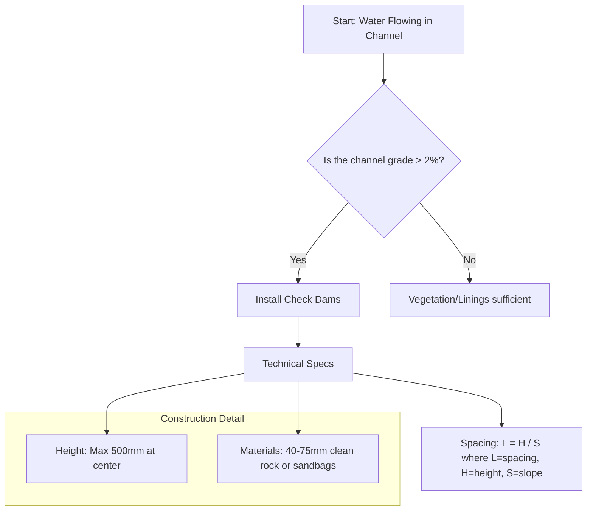
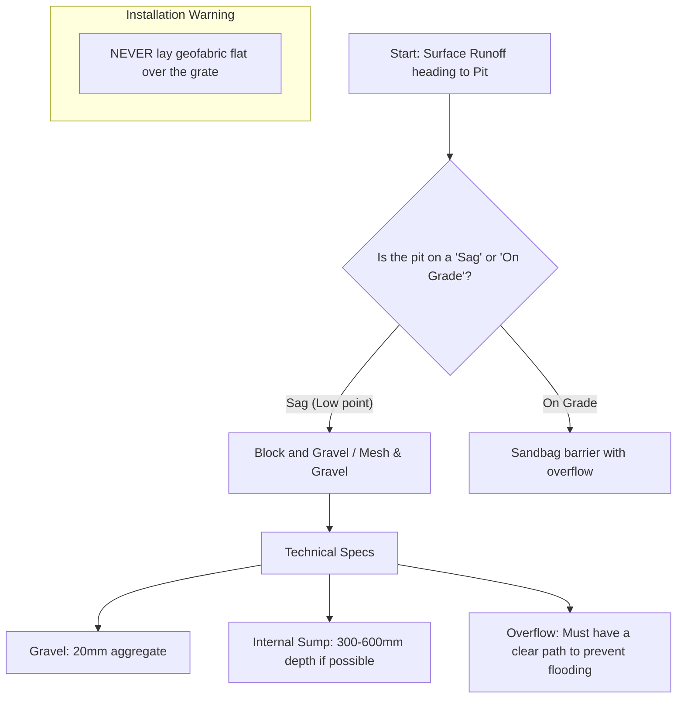

# Technical Diagrams - Dynamic Assessor

## 1. Check Dams (Rock/Sandbag)
Used in channels to reduce velocity and prevent erosion.

### Critical Maintenance:
- Remove sediment when it reaches 1/2 the height of the dam.
- Inspect for undercutting at the edges.

---

## 2. Stormwater Inlet Protection (Gully Pit)
Preventing sediment from entering the pipe network.

### Critical Maintenance:
- Replace aggregate if blinded with fine silt.
- Clear debris after every 10mm+ rain event.
